# Design Document: Billing Catch-Up Mechanism

## Overview

The billing catch-up mechanism adds two complementary recovery paths for missed monthly billing runs:

1. **Automatic startup recovery** — a new `BillingCatchupService` hosted service runs once on application startup, scans a configurable lookback window for months with no bills, and calls the existing `GenerateMonthlyBillsAsync` for each missed period in chronological order.
2. **On-demand SuperAdmin endpoint** — a new `POST /billing/catchup` endpoint lets a SuperAdmin trigger catch-up for any specific past period without restarting the server.

Both paths are fully idempotent: they delegate to the existing `GenerateMonthlyBillsAsync`, which already skips flats that have a bill for the target period. The only changes to existing code are:

- `IBillingService` / `BillingService` — add a `source` parameter to `GenerateMonthlyBillsAsync` so callers can stamp bills as `"catchup-startup"` or `"catchup-manual"`.
- `IBillRepository` — add `HasAnyBillsForPeriodAsync(string period)` for efficient cross-society missed-period detection.
- `appsettings.json` — add `BackgroundServices:BillingCatchupLookbackMonths`.
- `BillingEndpoints.cs` — add the new `POST /billing/catchup` route.
- `Program.cs` — register `BillingCatchupService` as a hosted service.

No existing billing flows, endpoints, or background services are modified in behaviour.

---

## Architecture

```mermaid
flowchart TD
    subgraph Startup
        A[Application Start] --> B[BillingCatchupService.StartAsync]
        B --> C{LookbackMonths == 0?}
        C -- yes --> D[Log warning, exit]
        C -- no --> E[Build period window\ncurrent-N .. current-1]
        E --> F[For each period:\nHasAnyBillsForPeriodAsync]
        F --> G{Any missed\nperiods?}
        G -- no --> H[Log info, exit]
        G -- yes --> I[Sort ascending\noldest first]
        I --> J[For each missed period:\nGenerateMonthlyBillsAsync\nsource=catchup-startup]
        J --> K[Log result / errors]
        K --> L[Log summary]
    end

    subgraph OnDemand
        M[POST /billing/catchup] --> N{SuperAdmin?}
        N -- no --> O[401/403]
        N -- yes --> P{Period valid?}
        P -- future or >12mo --> Q[400 Bad Request]
        P -- valid --> R[GenerateMonthlyBillsAsync\nsource=catchup-manual]
        R --> S[200 BillingResult]
    end

    subgraph ExistingServices
        T[MonthlyBillGenerationService\nday==1 loop] --> U[GenerateMonthlyBillsAsync\nsource=scheduled]
        V[POST /billing/generate-monthly] --> W[GenerateBillsAsync\nsource=manual]
        X[POST /billing/trigger-monthly-job-now] --> Y[GenerateMonthlyBillsAsync\nsource=scheduled]
    end
```



The `BillingCatchupService` runs **once** at startup (it is not a recurring loop). It uses `IServiceProvider` to create a scoped DI scope for each period it processes, matching the pattern used by `MonthlyBillGenerationService`.

---

## Components and Interfaces

### 1. `BillingCatchupService` (new)

**Location:** `SocietyLedger.Api/BackgroundServices/BillingCatchupService.cs`

```csharp
public sealed class BillingCatchupService : IHostedService
{
    // Runs once on startup; does NOT loop.
    public Task StartAsync(CancellationToken cancellationToken);
    public Task StopAsync(CancellationToken cancellationToken) => Task.CompletedTask;

    // Internal helpers
    private IReadOnlyList<string> BuildPeriodWindow(DateTime utcNow, int lookbackMonths);
    private Task<IReadOnlyList<string>> DetectMissedPeriodsAsync(
        IReadOnlyList<string> periods, IBillRepository billRepo);
    private Task<BillingResult> RunCatchupJobAsync(
        string period, string source, IServiceScope scope, CancellationToken ct);
}
```

Key design decisions:
- Implements `IHostedService` (not `BackgroundService`) because it only needs `StartAsync` — there is no recurring loop.
- Creates one `IServiceScope` per missed period to avoid long-lived scoped services.
- Catches and logs exceptions per period, continuing to the next period on failure (fault isolation).
- Reads `BackgroundServices:BillingCatchupLookbackMonths` from `IConfiguration`; defaults to `3`.

### 2. `IBillingService` — extended signature (modified)

**Location:** `SocietyLedger.Application/Interfaces/Services/IBillingService.cs`

Add an overload that accepts an explicit `source` parameter:

```csharp
/// <summary>
/// Generates monthly maintenance bills for ALL active societies.
/// The <paramref name="source"/> value is stamped on every created bill.
/// Accepted values: "scheduled", "catchup-startup", "catchup-manual".
/// </summary>
Task<BillingResult> GenerateMonthlyBillsAsync(DateTime? billingMonth = null, string source = "scheduled");
```

The existing callers (`MonthlyBillGenerationService`, `POST /billing/trigger-monthly-job-now`) continue to call the method without the `source` argument and therefore keep `"scheduled"` as the default — **no call-site changes required**.

### 3. `BillingService.GenerateMonthlyBillsAsync` — source threading (modified)

**Location:** `SocietyLedger.Infrastructure/Services/BillingService.cs`

The `source` parameter is threaded through to the `BillAddDto` constructor call inside the per-flat loop:

```csharp
newBills.Add(new BillAddDto(
    ...
    Source: source   // was hardcoded "scheduled"
));
```

No other logic changes.

### 4. `IBillRepository` — new method (modified)

**Location:** `SocietyLedger.Application/Interfaces/Repositories/IBillRepository.cs`

```csharp
/// <summary>
/// Returns true if ANY non-deleted bill exists for the given period across ALL societies.
/// Used by BillingCatchupService to efficiently detect whether a period was missed entirely.
/// </summary>
Task<bool> HasAnyBillsForPeriodAsync(string period);
```

This is a single cross-society query (e.g., `SELECT EXISTS(SELECT 1 FROM bills WHERE period = @period AND deleted_at IS NULL)`), which is far cheaper than calling `ExistsForPeriodAsync` once per society.

### 5. `CatchupBillingRequest` DTO (new)

**Location:** `SocietyLedger.Application/DTOs/Billing/CatchupBillingRequest.cs`

```csharp
/// <summary>
/// Request body for POST /billing/catchup.
/// </summary>
public record CatchupBillingRequest
{
    /// <summary>
    /// Target billing period in yyyy-MM format (e.g. "2026-04").
    /// When omitted, defaults to the previous calendar month.
    /// </summary>
    public string? Period { get; init; }

    /// <summary>
    /// Resolves the period to a UTC DateTime (first day of the month).
    /// Falls back to the previous UTC month when Period is null/empty.
    /// </summary>
    public DateTime GetBillingMonthDate()
    {
        if (!string.IsNullOrWhiteSpace(Period) &&
            DateTime.TryParseExact(Period, "yyyy-MM",
                System.Globalization.CultureInfo.InvariantCulture,
                System.Globalization.DateTimeStyles.None,
                out var parsed))
        {
            return new DateTime(parsed.Year, parsed.Month, 1, 0, 0, 0, DateTimeKind.Utc);
        }
        var prev = DateTime.UtcNow.AddMonths(-1);
        return new DateTime(prev.Year, prev.Month, 1, 0, 0, 0, DateTimeKind.Utc);
    }
}
```

### 6. `POST /billing/catchup` endpoint (new)

**Location:** `SocietyLedger.Api/Endpoints/BillingEndpoints.cs` — added inside `MapBillingRoutes`

```csharp
// POST /billing/catchup
app.MapPost("/catchup",
    [Authorize("SuperAdmin")]
    async ([FromBody] CatchupBillingRequest request, IBillingService billingService, HttpContext ctx) =>
    {
        var billingMonth = request.GetBillingMonthDate();
        var period = billingMonth.ToString("yyyy-MM");
        var currentMonth = new DateTime(DateTime.UtcNow.Year, DateTime.UtcNow.Month, 1, DateTimeKind.Utc);

        // Reject future periods
        if (billingMonth > currentMonth)
            return Results.Json(ErrorResponse.Create(...), statusCode: 400);

        // Reject periods older than 12 months
        if (billingMonth < currentMonth.AddMonths(-12))
            return Results.Json(ErrorResponse.Create(...), statusCode: 400);

        var result = await billingService.GenerateMonthlyBillsAsync(billingMonth, source: "catchup-manual");
        return Results.Ok(ApiResponse<BillingResult>.Success(result, $"Catch-up billing completed for {period}."));
    })
.RequireRateLimiting("AuthPolicy")
.WithTags(groupName)
...
```

### 7. Configuration (`appsettings.json`)

Add to the existing `BackgroundServices` section:

```json
"BackgroundServices": {
  "TrialExpirationIntervalHours": 24,
  "TrialExpirationRetryMinutes": 5,
  "MonthlyBillRetryMinutes": 5,
  "MonthlyBillMaxRetryAttempts": 3,
  "BillingCatchupLookbackMonths": 3
}
```

### 8. Service Registration (`Program.cs`)

```csharp
builder.Services.AddHostedService<BillingCatchupService>();
```

Added alongside the existing `MonthlyBillGenerationService` and `TrialExpirationService` registrations.

---

## Data Models

### `BillAddDto` — no structural change

The `Source` field already exists on `BillAddDto`. The only change is that `GenerateMonthlyBillsAsync` now accepts a `source` parameter and passes it through instead of hardcoding `"scheduled"`.

Valid `Source` values after this feature:

| Value | Set by |
|---|---|
| `"scheduled"` | `MonthlyBillGenerationService` (existing), `POST /billing/trigger-monthly-job-now` (existing) |
| `"manual"` | `POST /billing/generate-monthly` society-admin endpoint (existing) |
| `"flat-create"` | `GenerateBillForFlatAsync` (existing) |
| `"catchup-startup"` | `BillingCatchupService` on startup (new) |
| `"catchup-manual"` | `POST /billing/catchup` SuperAdmin endpoint (new) |

### Period window calculation

The lookback window is computed as follows:

```
utcNow = DateTime.UtcNow
currentMonth = new DateTime(utcNow.Year, utcNow.Month, 1, DateTimeKind.Utc)

periods = [
  currentMonth.AddMonths(-N).ToString("yyyy-MM"),
  currentMonth.AddMonths(-N+1).ToString("yyyy-MM"),
  ...
  currentMonth.AddMonths(-1).ToString("yyyy-MM")
]
```

The current month is **never** included in the window (the 1st of the current month may not have passed yet, and `MonthlyBillGenerationService` handles it). Periods are evaluated oldest-first.

---

## Correctness Properties

*A property is a characteristic or behavior that should hold true across all valid executions of a system — essentially, a formal statement about what the system should do. Properties serve as the bridge between human-readable specifications and machine-verifiable correctness guarantees.*

### Property 1: Period window bounds

*For any* current UTC date and any lookback window N ≥ 1, the set of periods evaluated by `BillingCatchupService` on startup SHALL contain exactly the N calendar months immediately preceding the current month, expressed as `yyyy-MM` strings in ascending order, and SHALL NOT contain the current month or any month more than N months in the past.

**Validates: Requirements 1.1, 1.5, 3.3**

### Property 2: Missed-period detection correctness

*For any* period in the lookback window and any state of the bills table, `BillingCatchupService` SHALL classify a period as missed if and only if `HasAnyBillsForPeriodAsync` returns `false` for that period. A period with at least one bill for any society SHALL NOT be classified as missed.

**Validates: Requirements 1.2, 1.3**

### Property 3: Catch-up idempotency

*For any* set of active flats and any subset of those flats that already have bills for a given period, calling `GenerateMonthlyBillsAsync` SHALL create bills only for flats without an existing bill, and the returned `BillsSkipped` SHALL equal the size of the pre-existing subset. Running the same call a second time SHALL produce `BillsCreated = 0` and `BillsSkipped = total flats`.

**Validates: Requirements 2.1, 2.2, 2.3**

### Property 4: Fault isolation across periods

*For any* set of missed periods where billing for one period throws an exception, `BillingCatchupService` SHALL still attempt and complete billing for all remaining periods. The number of periods attempted SHALL equal the total number of missed periods regardless of individual failures.

**Validates: Requirement 4.4**

### Property 5: Future period rejection

*For any* period string representing a month strictly after the current UTC month, `POST /billing/catchup` SHALL return HTTP 400 and SHALL NOT call `GenerateMonthlyBillsAsync`.

**Validates: Requirement 5.4**

### Property 6: Stale period rejection

*For any* period string representing a month more than 12 months before the current UTC month, `POST /billing/catchup` SHALL return HTTP 400 and SHALL NOT call `GenerateMonthlyBillsAsync`.

**Validates: Requirement 5.5**

### Property 7: Source field correctness

*For any* set of flats and periods processed by `BillingCatchupService` on startup, every bill created SHALL have `Source = "catchup-startup"`. *For any* set of flats and periods processed via `POST /billing/catchup`, every bill created SHALL have `Source = "catchup-manual"`. The existing `"scheduled"` and `"manual"` source values SHALL remain unchanged for their respective code paths.

**Validates: Requirements 6.1, 6.2, 6.3**

---

## Error Handling

### `BillingCatchupService` (startup)

| Scenario | Behaviour |
|---|---|
| `HasAnyBillsForPeriodAsync` throws | Log critical error, abort catch-up entirely (DB is likely unavailable) |
| `GenerateMonthlyBillsAsync` throws for one period | Log critical error with period + exception, continue to next period |
| All periods fail | Log summary with all failures; application continues to start normally |
| `LookbackMonths = 0` | Log warning "Billing catch-up is disabled (LookbackMonths=0)", return immediately |
| No active societies | `GenerateMonthlyBillsAsync` already handles this gracefully (returns `BillsCreated=0`) |

The catch-up service **never** prevents the application from starting. All exceptions are caught and logged.

### `POST /billing/catchup` (endpoint)

| Scenario | HTTP response |
|---|---|
| Not authenticated | 401 |
| Authenticated but not SuperAdmin | 403 |
| Period is in the future | 400 `PERIOD_IN_FUTURE` |
| Period is more than 12 months ago | 400 `PERIOD_TOO_OLD` |
| Period format invalid (not `yyyy-MM`) | 400 (handled by `CatchupBillingRequest.GetBillingMonthDate` defaulting to previous month; alternatively, explicit validation can be added) |
| `GenerateMonthlyBillsAsync` throws | 500 (handled by existing `ExceptionMiddleware`) |
| Success | 200 with `BillingResult` |

---

## Testing Strategy

### Unit Tests

Focus on the pure logic components that can be tested in isolation:

- **`BillingCatchupService` period window calculation** — verify `BuildPeriodWindow` returns the correct set of periods for various `utcNow` and `lookbackMonths` inputs, including boundary cases (N=1, N=0, month boundaries like January).
- **`BillingCatchupService` missed-period detection** — mock `IBillRepository.HasAnyBillsForPeriodAsync` to return various combinations of true/false and verify the correct periods are flagged as missed.
- **`BillingCatchupService` fault isolation** — mock `IBillingService.GenerateMonthlyBillsAsync` to throw for one period and verify remaining periods are still processed.
- **`CatchupBillingRequest.GetBillingMonthDate`** — verify correct parsing of valid `yyyy-MM` strings and correct fallback to previous month when omitted.
- **`POST /billing/catchup` validation** — verify 400 responses for future periods and periods older than 12 months.
- **Source field threading** — verify that `GenerateMonthlyBillsAsync` passes the `source` parameter through to `BillAddDto.Source` for each created bill.

### Property-Based Tests

Use a property-based testing library (e.g., [FsCheck](https://fscheck.github.io/FsCheck/) for .NET) with a minimum of 100 iterations per property.

Each property test is tagged with a comment referencing the design property:
`// Feature: billing-catchup, Property {N}: {property_text}`

**Property 1 — Period window bounds**
Generate random `DateTime` values (utcNow) and random `lookbackMonths` values (1–24). Assert that `BuildPeriodWindow(utcNow, lookbackMonths)` returns exactly `lookbackMonths` entries, the first entry is `lookbackMonths` months before the current month, the last entry is the previous month, and the current month is absent.

**Property 2 — Missed-period detection correctness**
Generate random sets of periods and random boolean responses from `HasAnyBillsForPeriodAsync`. Assert that the detected missed periods are exactly those for which the mock returned `false`.

**Property 3 — Catch-up idempotency**
Generate random sets of flats and random subsets with pre-existing bills. Assert that after calling `GenerateMonthlyBillsAsync`, `BillsCreated + BillsSkipped = total flats`, and calling it a second time yields `BillsCreated = 0`.

**Property 4 — Fault isolation across periods**
Generate random lists of periods (2–10) and randomly designate one as failing. Assert that the number of `GenerateMonthlyBillsAsync` calls equals the total number of periods.

**Property 5 — Future period rejection**
Generate random `yyyy-MM` strings representing months after the current UTC month. Assert that the endpoint validation returns a 400 error for all of them.

**Property 6 — Stale period rejection**
Generate random `yyyy-MM` strings representing months more than 12 months before the current UTC month. Assert that the endpoint validation returns a 400 error for all of them.

**Property 7 — Source field correctness**
Generate random sets of flats and periods. Call `GenerateMonthlyBillsAsync` with `source = "catchup-startup"` and verify all created `BillAddDto` records have `Source = "catchup-startup"`. Repeat with `source = "catchup-manual"`. Verify the scheduled path (no source argument) still produces `Source = "scheduled"`.

### Integration Tests

- Verify `BillingCatchupService` and `MonthlyBillGenerationService` running concurrently against a test database produce no duplicate bills (unique constraint enforcement).
- Verify `POST /billing/catchup` end-to-end against a test database: bills are created, `BillingResult` is returned, and `Source` is `"catchup-manual"`.
- Verify `HasAnyBillsForPeriodAsync` returns correct results against a seeded test database.
